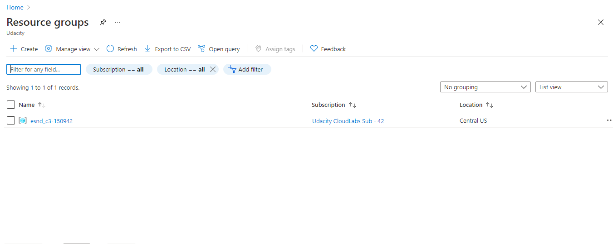

# Getting Started with Lab

1. Once the environment is provisioned, a virtual machine (JumpVM) and lab guide will get loaded in your browser. Use this virtual machine throughout the workshop to perform the the lab.
1. To get the lab environment details, you can select **Lab Environment** tab. 

   
 
 
 
## Login to Azure Portal
1. In the JumpVM, click on Azure portal shortcut of Microsoft Edge browser which is created on desktop.

   
   
1. When you click on Azure portal, edge browser welcome screen will come up, select **Get started**.

   
   
1. On next window, click on **Confirm**.

   
   
1. Now, you can close the popup which is coming up.

   
   
1. Now, you will see two tabs in edge browser, close first tab named with **Microsoft Edge**.

   
   
1. On **Sign in to Micsoft Azure** tab you will see login screen, in that enter following email/username and then click on **Next**. 
   * Email/Username: <inject key="AzureAdUserEmail"></inject>
   
     
     
1. Now enter the following password and click on **Sign in**.
   * Password: <inject key="AzureAdUserPassword"></inject>
   
     
     
1. If you see the pop-up **Stay Signed in?**, click No

1. If you see the pop-up **You have free Azure Advisor recommendations!**, close the window to continue the lab.

1. If a **Welcome to Microsoft Azure** popup window appears, click **Maybe Later** to skip the tour.
   
1. Now you will see Azure Portal Dashboard, click on **Resource groups** to see the resource groups.

   
   
1. Confirm you have all resource group are present as shown below.

   
   
1. Now, click on the **Resource group** 
